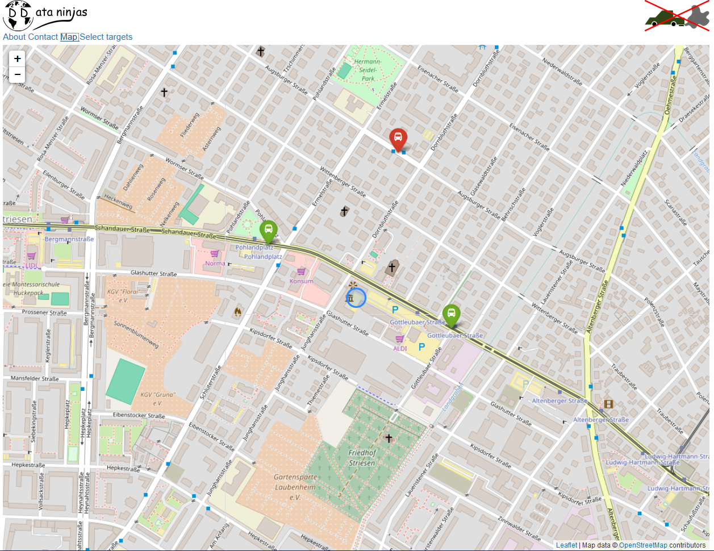

# Lass die Karre steh'n

This is a project to help you save the world! Avoid air pollution and take the bus or tram. And the best: You get a reward for it!

## Technical

### Prepare trias data

There is a small node server, which fires requests against the trias web interface and returns the trip request data as json to be used within the webapp. By default it runs on port 8081.

You can start the server by:

    cd backend2
    node server.js

If you run it locally, test it by calling for example [this url](http://localhost:8081/connection?start_lng=13.751272&start_lat=51.073372&end_lng=13.733651&end_lat=51.039059).

For the first time start you have to do:

    cd backend2
    npm install
    node server.js

#### Rest interface

The trias data are available for the current timepoint and the following url:

    http(s)://<your host>:<your port>/connection?start_lng=<start coordinates, longitude>&start_lat=<start coordinates, latitude>&end_lng=<end coordinates, longitude>&end_lat=<end coordinates, latitude>

### Live air quality data

T.b.d.

### Live weather data

T.b.d.

### Live prediction of air quality for the next day

T.b.d.
